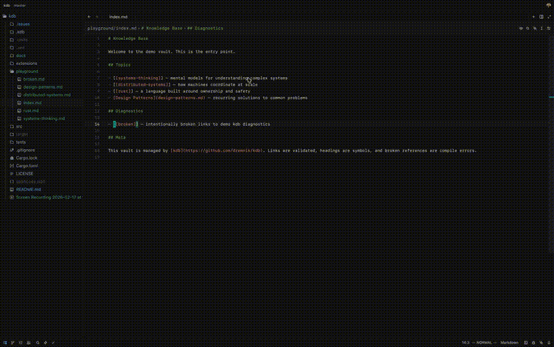

# kdb

A compiler and language server for markdown knowledge bases.

Treats a directory of markdown files like a codebase — headings are symbols, links are references, and broken links are compile errors.

If you've used Obsidian, the concept is familiar — but kdb is not tied to any app. It's an open standard for markdown knowledge bases with a compiler and language server that works in any editor.



## Knowledge = Code

| Code               | Knowledge                                   |
|---------------------|---------------------------------------------|
| Module              | Markdown file                               |
| Exported symbol     | Heading (`## Definition`)                   |
| Import / reference  | Link (`[text](file.md#heading)`)            |
| Compile error       | Broken link (target file/heading missing)   |
| Dead code           | Orphan file (nothing links to it)           |
| Public API          | Outline (heading tree of a file)            |
| Interface           | Template (expected structure for a category)|
| Dependency graph    | Link graph across files                     |

## Quickstart

1. Install the CLI:

```
cargo install --path .
```

2. Add the editor extension:

| Editor | Install |
|--------|---------|
| Zed    | Extensions panel → search "kdb" → Install |
| VSCode | Coming soon |

3. Init a kdb in your project:

```
cd my-project
kdb init
```

This creates a `.kdb/` directory at the root of your project. **All kdb commands require this directory** — it marks the vault boundary and is where kdb stores its configuration and index cache. You now get go-to-definition, autocomplete, hover previews, diagnostics, and document symbols in your editor.

## Link Syntax

Both standard markdown links and wikilinks are supported:

```markdown
[React Hooks](react/hooks.md#useEffect)
[[react/hooks#useEffect]]
```

## Commands

```
kdb init               # initialize a kdb project (creates .kdb/config.toml)
kdb fmt [path]         # generate/update code index headers (Rust, TS/JS, Python, Go)
kdb check [--orphans]  # report broken links and warnings (orphans with --orphans)
kdb tree [path]        # print filtered directory tree
kdb symbols <path>     # print markdown/code symbols for a file
kdb refs <target>      # find inbound refs to a file or heading (--json, --count)
kdb deps <file>        # list outbound deps for a markdown/code file (--json)
kdb graph              # output dependency graph (dot format)
kdb lsp                # start the language server (stdio)
```

With the LSP running, `kdb` advertises document formatting for supported code
files. In Zed, you can chain multiple formatters on save so language-native
formatters (rustfmt/prettier/black/gofmt) run first and `kdb` runs second.

Zed (example for Rust):

```json
{
  "languages": {
    "Rust": {
      "formatter": [
        { "language_server": { "name": "rust-analyzer" } },
        { "language_server": { "name": "kdb" } }
      ],
      "format_on_save": "on"
    }
  }
}
```

## Development

### Changelog

Maintained with [git-cliff](https://git-cliff.org/). Config in `cliff.toml`.

Commits follow [conventional commits](https://www.conventionalcommits.org/) (`type(scope): description`). To regenerate:

```
git cliff -o CHANGELOG.md
```

## License

MIT
